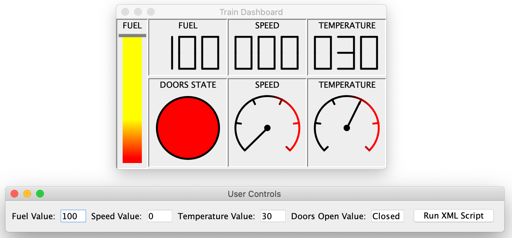
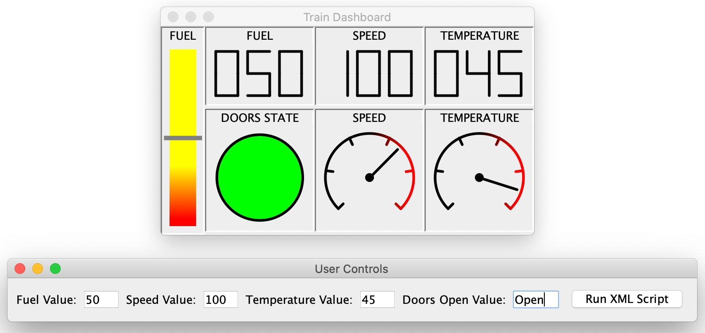

# Advanced Programming Coursework

//

## Table of Contents
1. [General Info](#1-general-info)
2. [Technologies](#2-technologies)
3. [Features](#3-features)
4. [Status](#4-status)

## 1. General Info

## 2. Technologies
- Java (ver 15.0.1)

## 3. Features
- 

## 4. Status
This program is complete

### Requirements
To create a dashboard for a train containing 3 different types of display indicators and simulated using a test journey

### Key Features
* Inheritance & interfaces
* JUnit Testing
* Design Patterns
* JavaBean Components
* Threads

### Language
* Java
